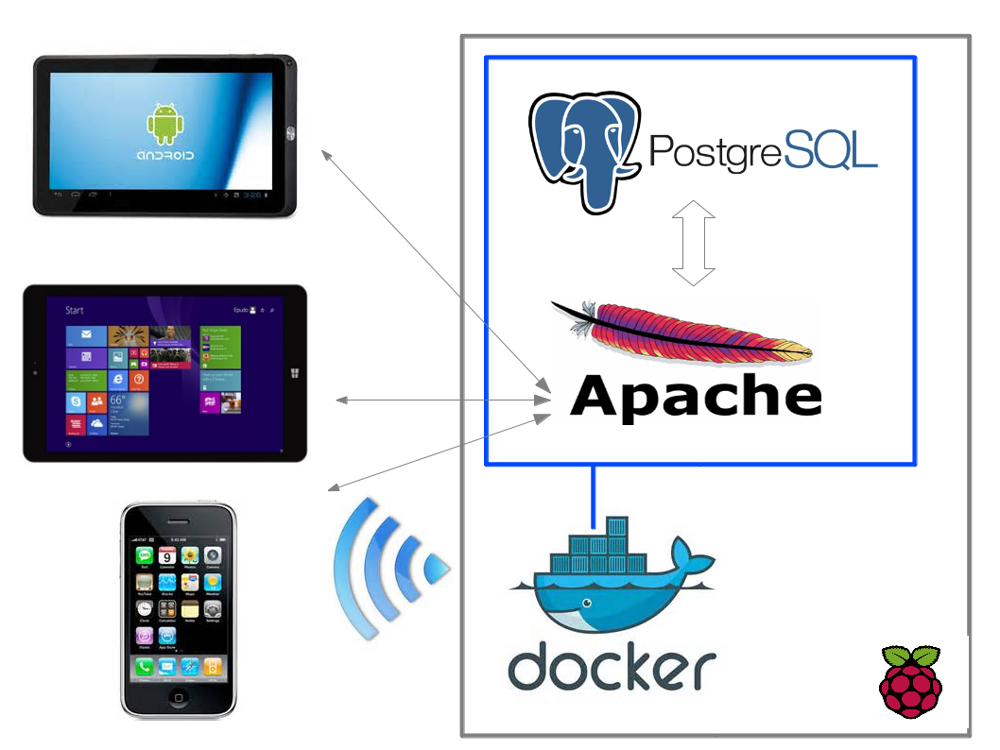
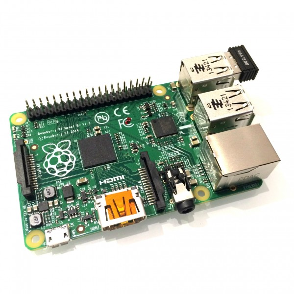
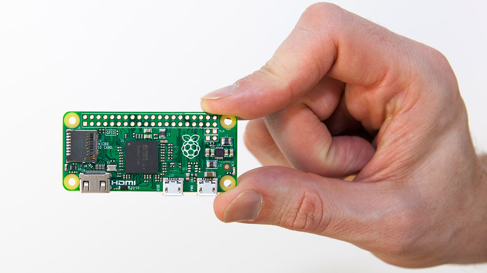

## Une (la ?) solution : Nano-ordinateur

 <h3>Principe</h3>

--- 

## Une (la ?) solution : Nano-ordinateur

 <h3>Les avantages</h3>
 
 
 - Compatible avec les supports existants : peu de dépenses
 
 - Utilisation de formulaires existants : pas de dépaysement !
 
 - OS Linux : fiabilité
 
 - Déport de l'autonomie et de la "complexité" sur le rpi

--- 

## Une (la ?) solution : Nano-ordinateur

 <h3>Les inconvénients</h3>

 - Adaptation de l'ergonomie des formulaires
 
 - Quelques paramétrages ...
 
 - Formation à Docker (rentable mais pas pas indispensable)
 
 - Synchronisation nécessaire 
 
 - Gestion des UUID

--- 

## Premier bilan

 
 - 3 applications installées :
   - relevés floristiques
   - suivi de dendro-microhabitats
   - indice de biodiversité potentielle

 - Satisfaction générale !
 
 - Pas de perte de données 

--- 

## Points d'attention

 
 - Alimentation : 5V et 700mA minimum

=> bien choisir sa batterie !

 - Evolution rapide des versions ...
 
 - Sauvegarde : duplication des répertoires 
 de PostgreSQL sur clé
 

--- 

## Evolutions actuelles

 
 - Load balancing pour les applications gourmandes

 - Projet Pi4x4 pour une tablette durcie open-source

 

 
 
 
