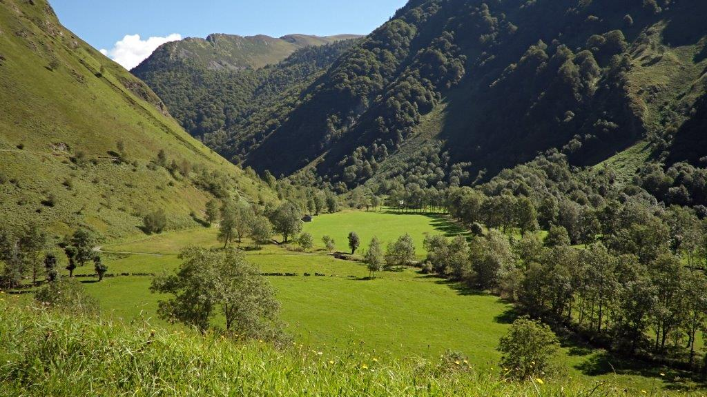
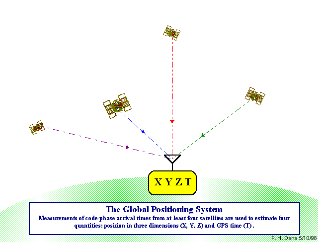

---
title       : "Peut on géolocaliser des arbres dans les forêts de montagne avec un GPS ?"
subtitle    : Premiers éléments de réponse
author      : Wilfried Heintz, Laurent Burnel, Jérôme Willm, Jérôme Molina, Laurent Larrieu
date        : October 11, 2016
job         : UMR 1201 Dynafor, INRA, Toulouse
framework   : io2012        # {io2012, html5slides, shower, dzslides, ...}
highlighter : highlight.js  # {highlight.js, prettify, highlight}
hitheme     : tomorrow      #   
widgets     : [bootstrap, quiz]            # {mathjax, quiz, bootstrap}
mode        : selfcontained # {standalone, draft}
license     : by-nc-sa
logo        : INRA_logo.png
knit        : slidify::knit2slides
ext_widgets : {rCharts: [libraries/nvd3]}

--- 
## Contexte

<h3>Ecologie des paysages agri-forestiers</h3>

--- 
## Contexte

<h3>Ecologie des paysages agri-forestiers</h3>

 - Recherches pluri-disciplinaires :
  - Différents taxons
  - Différentes zones d'études
  - Suivis à long terme

--- 
## Contexte

<h3>Ecologie des paysages agri-forestiers</h3>

 - Des besoins communs :
  - Cartographier les territoires
  - Géolocaliser nos objets d'études

--- 
## Les dendo-microhabitats de montagne

<h3>Un milieu particulier</h3>

 - Fortes pentes
 - Orientations défavorables
 - Couvert forestier très dense
 - Zones rocheuses 

--- 
## Les dendo-microhabitats de montagne

<h3>Des exigences de précision</h3>

 - Re-identifier des arbres plusieurs années après 

=> s'approcher le plus près de l'individu
 - Le plus rapidement possible

--- 
## Le système GPS

<h3>Global Positionning System</h3>

 - Calcul de phase avec satellite
 - Précision de 5 à 15m
 - ... Dépendante du matériel
 - ... Et des conditions environnementales

--- 
## Objectifs de l'expérience

<h3>Comparer la précision de plusieurs appareils</h3>

 - Un appareil grand public
 - Un appareil haut de gamme
 - Un appareil haut de gamme 
 + corrections temps réel
 
--- 
## Mode opératoire

<h3>Prise de coordonnées</h3>

 - Un référentiel : télémètre laser
 - 

