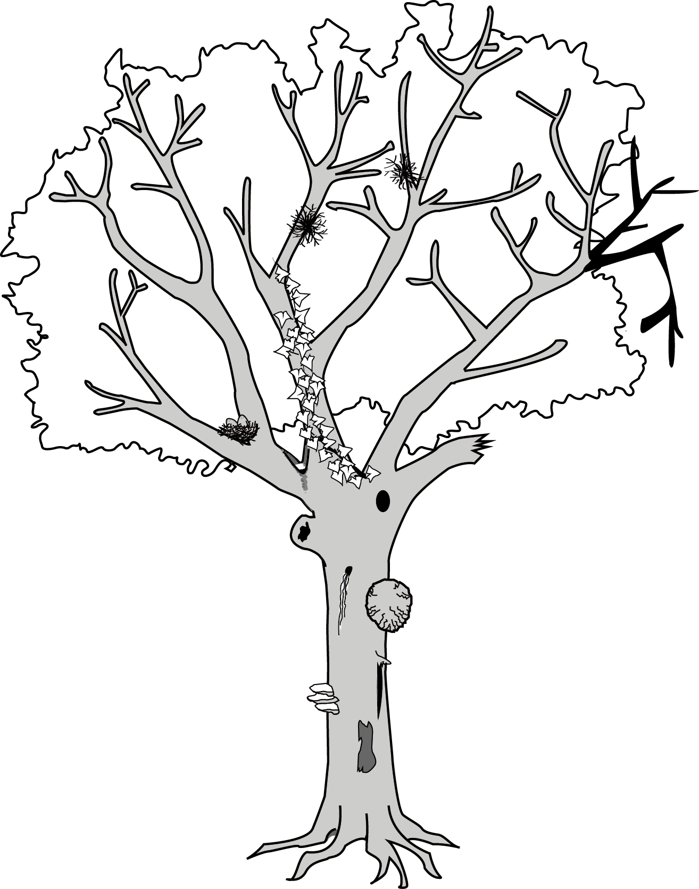
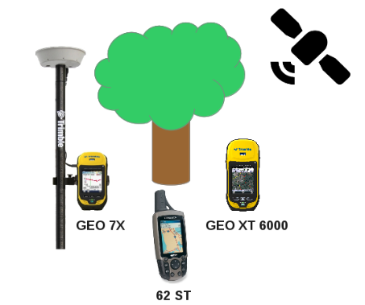
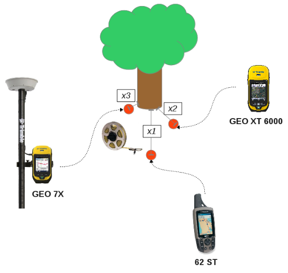
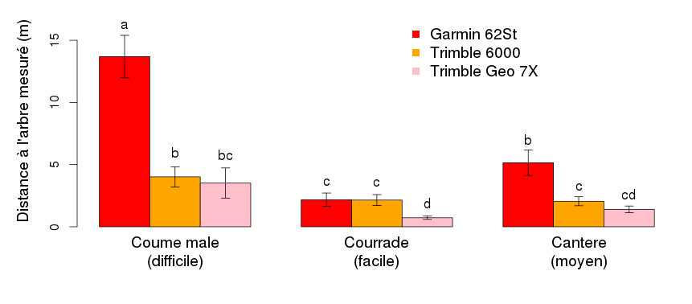
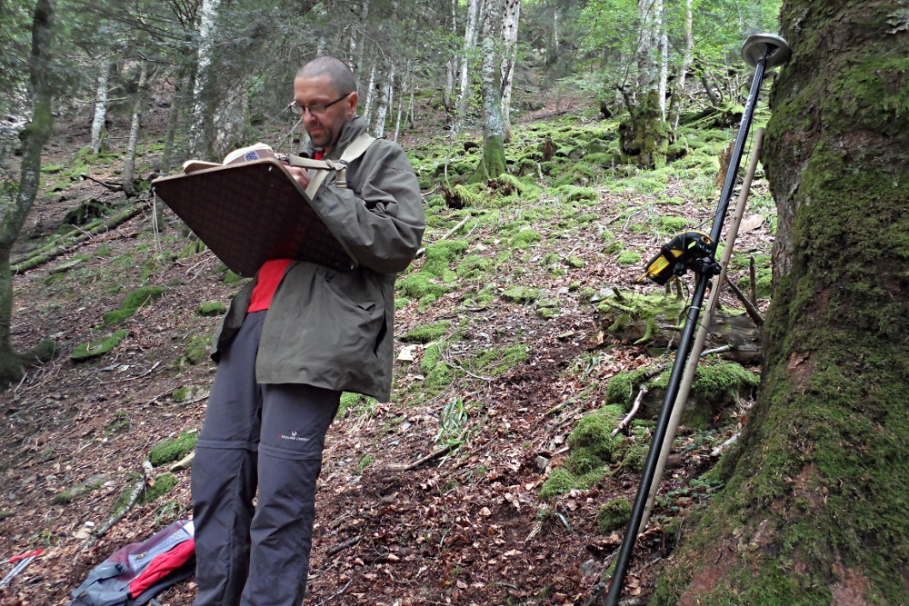

---
title       : "Une antenne GPS centimétrique autonome low-cost."
subtitle    :  "Oui ça existe !"
author      : Wilfried Heintz, Laurent Burnel, Jérôme Molina, Julien Ancelin
date        : October 11, 2018
job         : UMR 1201 Dynafor, INRA, Toulouse
framework   : io2012        # {io2012, html5slides, shower, dzslides, ...}
highlighter : highlight.js  # {highlight.js, prettify, highlight}
hitheme     : tomorrow      #   
widgets     : [bootstrap, quiz]            # {mathjax, quiz, bootstrap}
mode        : selfcontained # {standalone, draft}
license     : by-nc-sa
logo        : INRA_logo.png
knit        : slidify::knit2slides
ext_widgets : {rCharts: [libraries/nvd3]}

--- 
## Présentation

- Contexte de l'étude
- Forêts de montagne
- Dendro-microhabitats
- Le système GPS
- Objectifs de l'expérience
- Mode opératoire
- Premiers résultats
- Conclusions provisoires

--- 
## Contexte

<h3>Ecologie des paysages agri-forestiers</h3>

--- 
## Contexte

<h3>Ecologie des paysages agri-forestiers</h3>

 - Recherches pluri-disciplinaires :
  - Différents taxons
  - Différentes zones d'études
  - Suivis à long terme

--- 
## Contexte

<h3>Ecologie des paysages agri-forestiers</h3>

 - Des besoins communs :
  - Cartographier les territoires
  - Géolocaliser nos objets d'études

--- 
## Les forêts de montagne

<h3>Un milieu particulier</h3>

 - Fortes pentes
 - Orientations défavorables
 - Couvert forestier très dense
 - Zones rocheuses 

--- 
## Les dendo-microhabitats

<h3>Des exigences de précision</h3>

 - Re-identifier des arbres plusieurs années après 

=> s'approcher le plus près de l'individu
 - Le plus rapidement possible

--- 
## Le système GPS

<h3>Global Positionning System</h3>

 - Calcul de phase avec satellite
 - Précision de 5 à 15m
 - ... Dépendante du matériel
 - ... Et des conditions environnementales

--- 
## Objectifs de l'expérience

<h3>Comparer la précision de plusieurs appareils</h3>

 - Grand public
 - Haut de gamme
 - Haut de gamme + corrections temps réel

--- 
## Mode opératoire

<h3>1/ Prise de coordonnées</h3>

 - 3 zones à la topographie distincte (30 arbres par zone)
 - Un référentiel : télémètre laser
 - Chaque appareil enregistre les coordonnées

<h3>2/ Retour à l'arbre</h3>

 - Suivant les coordonnées de références
 - En un temps limité
 - On évalue la distance à l'arbre

--- 
## Premiers Résultats

--- 
## Conclusions provisoires

 - Différences de précision significatives
 - Importance du premier relevé !
 - Bien définir les conditions d'exploitation de l'appareil
 - Bien choisir sa saison d'expérimentation
 - D'autres facteurs à tester : éphémérides, marque du GPS ...

--- 

## Merci pour votre attention

