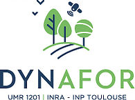
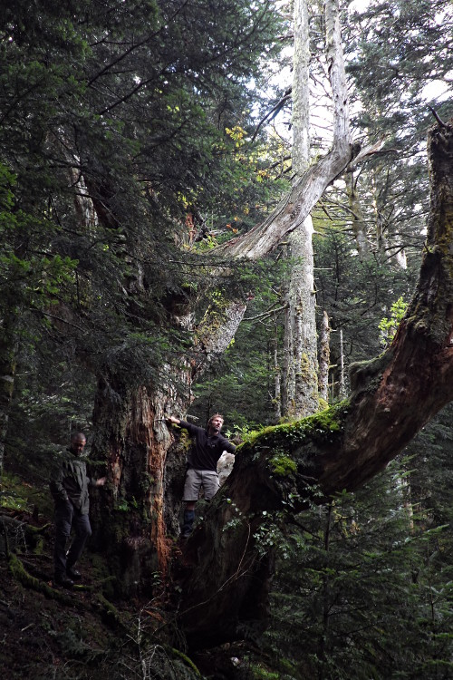
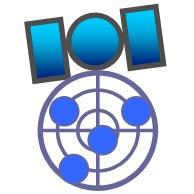
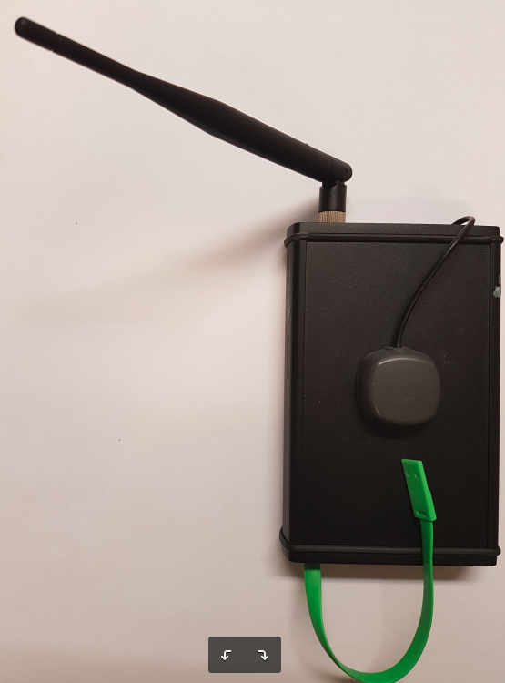
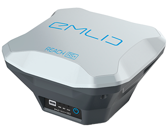
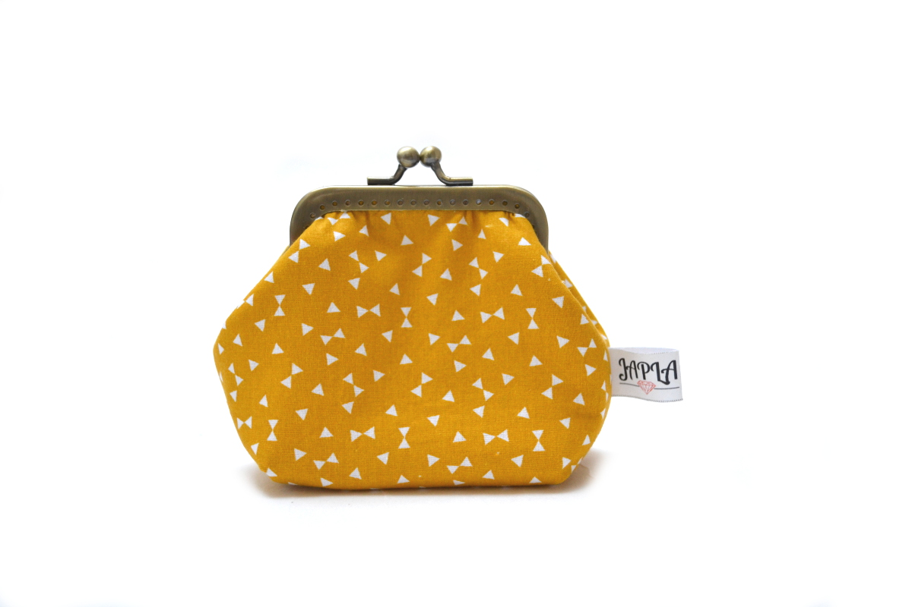
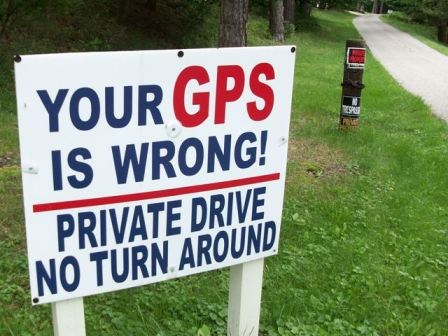

---
title       : "Une antenne GPS centimétrique low-cost."
subtitle    :  "Oui ça existe !"
author      : Wilfried Heintz, Laurent Burnel, Jérôme Molina, Julien Ancelin
date        : October 11, 2018
job         : UMR 1201 Dynafor, INRA, Toulouse
framework   : io2012        # {io2012, html5slides, shower, dzslides, ...}
highlighter : highlight.js  # {highlight.js, prettify, highlight}
hitheme     : tomorrow      #   
widgets     : [bootstrap, quiz]            # {mathjax, quiz, bootstrap}
mode        : selfcontained # {standalone, draft}
license     : by
logo        : INRA_logo.png
knit        : slidify::knit2slides
ext_widgets : {rCharts: [libraries/nvd3]}

--- 
## Présentation

- Contexte de Recherche
- Zones d'études reculées
- Rappel : Le système GPS
- Solution actuelle 
- RTK
- Alternative low-cost
- Quelques chiffres
- Le réseau Centipède
- Perspectives

--- 
## Contexte

<h3>Ecologie des paysages agri-forestiers</h3>

--- 
## Contexte

<h3>Ecologie des paysages agri-forestiers</h3>

 - Recherches pluri-disciplinaires :
  - Différents taxons
  - Différentes zones d'études
  - Suivis à long terme

--- 
## Contexte

<h3>Ecologie des paysages agri-forestiers</h3>

 - Des besoins communs :
  - Cartographier les territoires
  - Géolocaliser nos objets d'études

--- 
## Des zones d'études reculées

<h3>Géolocalisation difficile</h3>

 - Fortes pentes
 - Orientations défavorables
 - Couvert forestier très dense
 - Zones rocheuses 
 - Signal GSM rare ou absent

--- 
## Rappel : Le système GPS

<h3>Global Positionning System</h3>

 - Calcul de différence de phase avec satellite
 (1 μs <=> 300m d'écart !)
 - Précision de 5 à 15m
 - ... Dépendante du matériel
 - ... Et des conditions environnementales

--- 
## Les solutions actuelles (cf. J2M 2016)

<h3>Appareils centimétriques</h3>
 - Corrections avancées
 - Positionnement centimétrique réel

<u>MAIS</u>

 - Bugs OS
 - (Trop !) coûteux
 - Signal correctif (VRS) payant
 - Mises à jour payantes

--- 
## RTK

<h3>Puce RTK</h3>
 - Librairie RTKLib
 - Principe Real Time Kinematic
 - Calcul de différence sur phase porteuse 
 - ==> Position centimétrique

--- 
<<<<<<< HEAD
## Alternative low-cost
=======
## Système D ou clé en main

>>>>>>> refs/remotes/origin/master

<h3>Antenne autonome "maison"</h3>
 - Fabriquée par Julien Ancelin (INRA)
 - Basée sur puce Reach RTK Emlid
 - Interfacée sur tablette ou smartphone 
 - Envoi du signal corrigé par radio

--- 
<<<<<<< HEAD
## Alternative low-cost

=======
## Système D ou clé en main

>>>>>>> refs/remotes/origin/master

<h3>Antenne Reach RS+</h3>
 - Fabriquée par EMLID
 - Embarque la puce Reach M+
 - Prête à utiliser

--- 
## Quelques chiffres

<<<<<<< HEAD
<h3>Coût des solutions</h3>
 - GPS centimétrique : ~ 15000€
 - Abonnement VRS : ~ 2000€/an
 - 
 - Reach M+ : 245$
 - Reach RS+ : 799$
=======
<h3>GPS centimétrique</h3>
 -  ~ 15000 €

<h3>Signal corrigé</h3>
 -  ~ 2000 € / an
 
<h3>Reach M+</h3>
 -  ~ 250 $

<h3>Reach RS+</h3>
 -  ~ 800 $
>>>>>>> refs/remotes/origin/master

--- 
## Réseau Centipède

<h3>Réseau d'antennes ouvertes</h3>
 - Mis en oeuvre par J. Ancelin
 - Réseau d'antennes autonomes
 - Signal corrigé "centralisé"
 - ... Puis renvoyé en http
 - projet d'extension en Occitanie
 

--- 
## Perspectives

 - Faire un comparatif approfondi
 - Tester l'autonomie et la durabilité
 - Enrichir le réseau Centipède

--- 

## Merci pour votre attention

