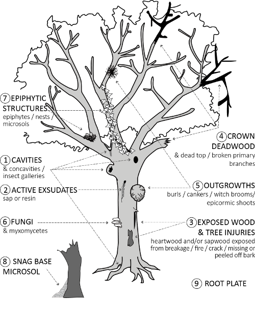
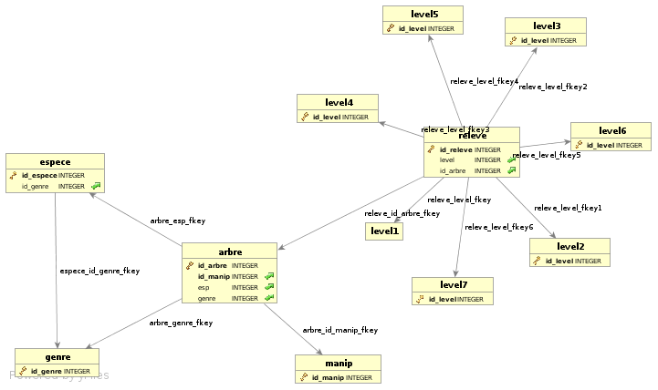

---
title       : "Bases de données Dynafor"
subtitle    : Point sur l'intégration des données
author      : Wilfried Heintz
date        : December 15, 2016
job         : UMR 1201 Dynafor, INRA, Toulouse
framework   : io2012        # {io2012, html5slides, shower, dzslides, ...}
highlighter : highlight.js  # {highlight.js, prettify, highlight}
hitheme     : tomorrow      #   
widgets     : [bootstrap, quiz]            # {mathjax, quiz, bootstrap}
mode        : selfcontained # {standalone, draft}
license     : by-nc-sa
logo        : Dynafor.jpg
knit        : slidify::knit2slides
ext_widgets : {rCharts: [libraries/nvd3]}

--- 
## Un serveur dédié

<h3>Pour des BDD partagées et pérennes</h3>

 - Machine virtuelle hébergée et <b><u>sauvegardée</u></b> sur le datacenter
 - Logiciel PostgreSQL
 - Accessible à tous : 147.100.166.41
 - ... Moyennant une authentification.

--- 

## Des outils pour consulter

<h3>Phppgadmin</h3>

 
 - Accessible en ligne depuis partout
 - Via un navigateur Web
 - http://dynafor.toulouse.inra.fr/phppgadmin
  
 - Ergonomie limitée ...

--- 

## Des outils pour consulter

<h3>PgAdmin4</h3>

 
 - Client monoposte à installer
 - Procédure d'authentification moins "immédiate"
  
 - Ergonomie et fonctionnalités améliorées
 

--- 

## Solutions pour déposer des données

<h3>Manuellement</h3>

 - Avec phppgamdin ou en ligne de commande
 - Tableau CSV -> table de base de données
 - ! Respect de la structure de la table !

<h3>Automatiquement</h3>

 - Nano-ordinateurs : BDD embarquée
 - A ce propos : Journée RBDD "Cahiers de Terrain électroniques"
    http://rbdd.cnrs.fr/spip.php?article206 
 - Projet Pi4x4

--- 

## Solutions pour déposer des données géographiques

<h3>Manuellement</h3>

 - shp2pgsql  
<code>shp2pgsql -s SRID myshapefile.shp myschema.mytable > myfile.sql</code>
 
 - ogr2ogr  
<code>ogr2ogr -f 'PostgreSQL' PG:'host=myhost user=myloginname dbname=mydbname password=mypassword' myshapefile.shp</code>

<h3>Avec assistant</h3>

 - QGIS + DBManager

--- 
## Des outils pour manipuler

<h3>QGIS</h3>

 - Logiciel SIG libre et gratuit :-D
 - Peut se connecter à une base pour afficher/éditer des données géographiques
  
 - Ergonomie et fonctionnalités améliorées
 

--- 
## Des outils pour manipuler

<h3>ArcGIS</h3>

 - Logiciel SIG propriétaire et payant :-(
 - Mais très utilisé et dispose d'un SAV !
 - Peut se connecter à une base pour afficher/éditer des données géographiques
  
 - Nécessite l'extension <b>PostgreSQL Client Libraries</b>
 

--- 
## Des outils pour manipuler

<h3>R</h3>

 - Logiciel libre et gratuit :-)
 - Peut se connecter à une base pour générer un dataframe
 - via un package (RPostgreSQL)

--- 
## Quelques chiffres

<h3>Bases de données de projet</h3>

 - 13 dont 12 spatiales
 - 4 interfacées
 - 2 diffusées sur Internet
 - 2 éditées "en direct" par des agents Dynafor
 
 <b>=> N'hésitez plus à convertir vos données !</b>

--- 
## Focus sur EasyTrems

<h3>Bases de données dendromicrohabitats</h3>

 - 7 niveaux hiérarchiques imbriqués
 - 1 table relevés
 - 4 tables référentielles (arbre,manip,espèce,genre)
 
 - Interface Internet + Pi

--- 
## Focus sur EasyTrems

