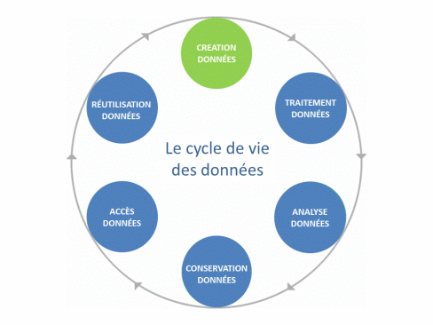
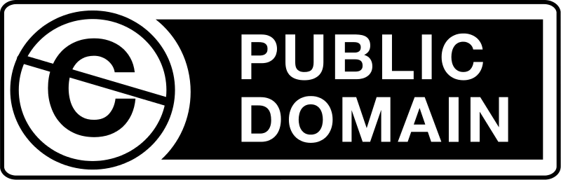
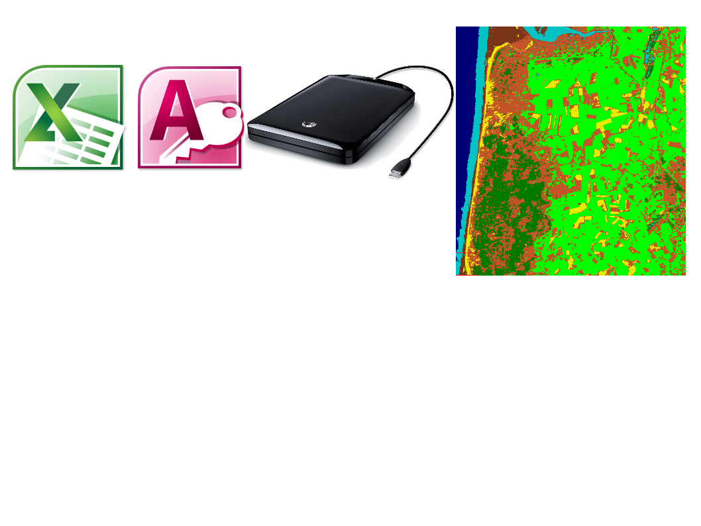
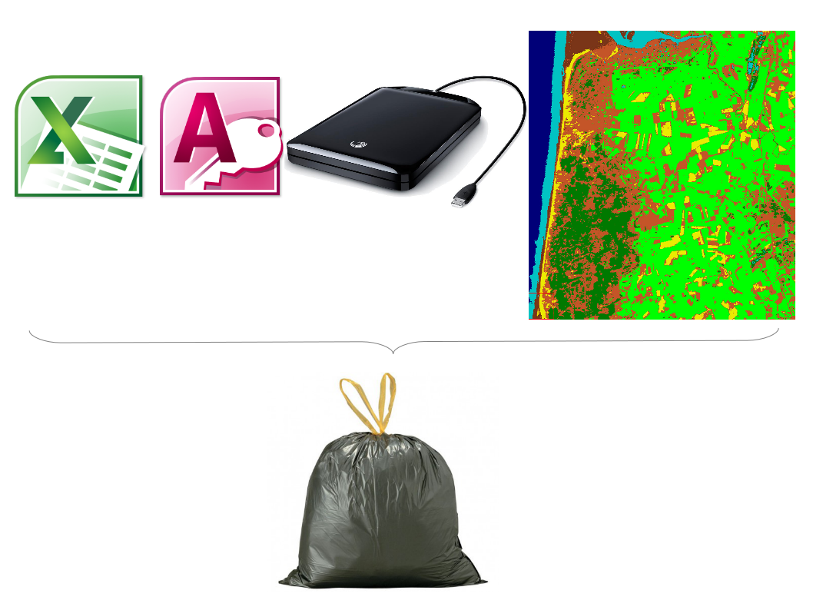
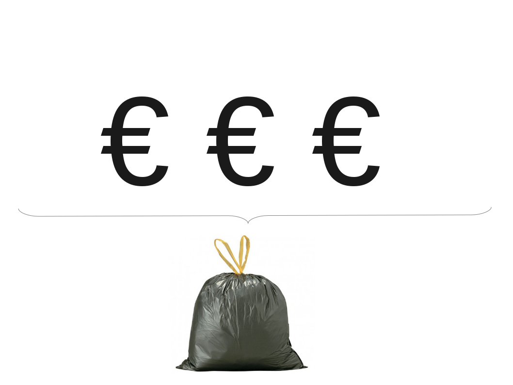

---
title       : "La gestion des données de la collecte jusqu'à la publication"
subtitle    : Les avancées de l'IDS Dynafor
author      : Wilfried Heintz
date        : April 15, 2016
job         : UMR 1201 Dynafor, INRA, Toulouse
framework   : io2012        # {io2012, html5slides, shower, dzslides, ...}
highlighter : highlight.js  # {highlight.js, prettify, highlight}
hitheme     : tomorrow      #   
widgets     : [bootstrap, quiz]            # {mathjax, quiz, bootstrap}
mode        : selfcontained # {standalone, draft}
license     : by-nc-sa
logo        : Dynafor.jpg
knit        : slidify::knit2slides
ext_widgets : {rCharts: [libraries/nvd3]}

--- 
## Le cycle de vie des données

<h3>Les étapes importantes</h3>

 - (Le plan de gestion de données)
 - La collecte (venez à l'école technique !)
 - Le contrôle qualité et l'intégration (faites des métadonnées !)
 - La structuration / sauvegarde
 - Le traitement / enrichissement
 - La publication / diffusion (venez au séminaire "datapapers" !)
 

--- 

## Les temps changent ...

<h3>Les apports d'Inspire & de l'Opendata</h3>

 
 - Ouverture des données de la recherche (open-science)
 - Loi "text and data mining" (TDM - 23/04/16)
 - Avis n°8 comité éthique Inra-Cirad
 - Donnée financée par argent public = donnée publique

=> Organiser le partage de nos données

--- 

## Les pratiques aussi

--- 
## Les pratiques aussi

--- 
## Les pratiques aussi

--- 
## DMP

 <h3>Data Management Plan</h3>
 
 - Décrit/organise le suivi du cycle de vie des données
 - Obligatoire pour les projets H2020
 - Formalise des bonnes pratiques (qui devraient être) évidentes

--- 
## Collecte 

<h3>Les systèmes embarqués  (Ateliers carnets électroniques OSU OREME 04/16)</h3>

 - <u>Inconvénients</u>
  - prise en main
  - configuration
  

--- 
## Collecte 

 - <u>Avantages</u>
  - économie de temps (saisie)
  - contrôle des données
  - saisies simultanées
  - sécurité des données

--- 
## Collecte 

 - <u>Développements en cours</u>
  - (ré)utilisation des tablettes
  - déport des services sur nano-ordinateurs
  - interfaces personnalisées

--- 
## Intégration

 <h3>Métadonnées  (Rochebrune 01/16)</h3>

 - Généalogie des données (protocole, projet, objectifs scientifiques ...)
 - Eléments d'exploitation de la données (format, résolution ...)
 - Normalisées (Inspire, EML, ISO ...)
 
=> Point de rencontre Collecte/Gestion/Exploitation
=> Pérennisation des données

--- 
## Contrôle qualité

 <h3>"Data curation"  (Formation GBIF 09/15)</h3>

 - Scripts R
 - ETL
 - Outils divers (Google Refine)
 
=> 

--- 
## Structuration / Sauvegarde

 <h3>Système d'Information   (Sciences des données IRIT 04/16</h3>

 - Bases de données <u>en ligne</u>
 - Découverte - visualisation - exploitation
 - Hébergement pérenne (Datacenter)

--- 
## Traitement / Enrichissement

 - Accès partagé aux données référentielles (postgis, thredds ...)
 - Pas de chargement local
 

--- 
## Publication / Diffusion

DOI
Datapapers
entrepôts de données
publication des traitements

=> science reproductible
