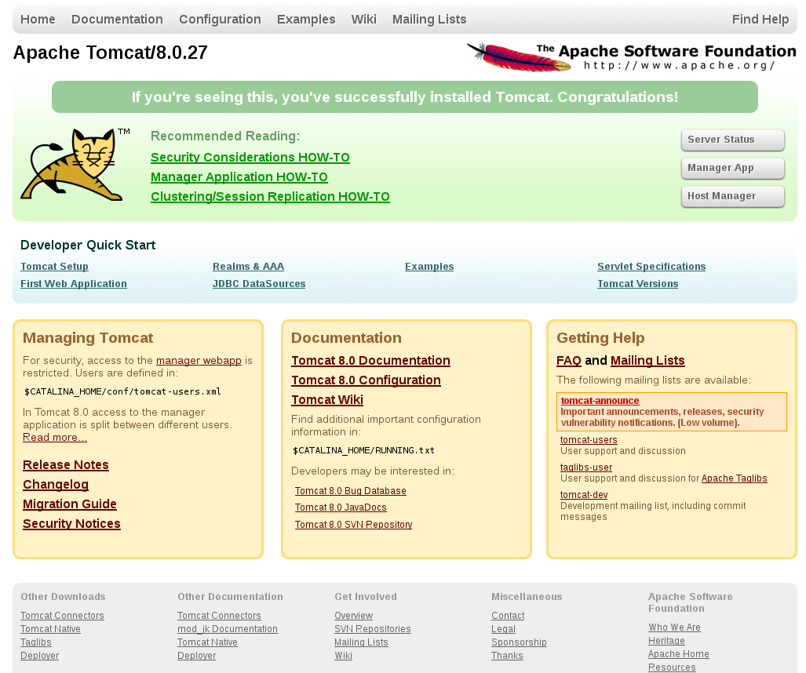

##  Pourquoi Fuseki ?

   - Projet de la `fondation Apache`
      - Open-source
      - Communauté importante de développeurs
      - Expérience reconnue
   - Déploiement dans Tomcat
   - Persistance des données gérées
 

---

##  Pré-requis indispensables

  <h3>Machine connectée + Java + Tomcat</h3>

 - Exemple avec un serveur Linux Ubuntu
 - Port 8080 ouvert
 - Droits d'administration

---
##  Préparation de la machine

  <h3>Installation de Java</h3>
  <h4><i>Source : https://wolfpaulus.com/journal/software/tomcat-jessie </i></h4>

    - $ java -version
    - $ su root
    - $ echo "deb http://ppa.launchpad.net/webupd8team/java/ubuntu trusty main" 
      > /etc/apt/sources.list.d/webupd8team-java.list
    - $ echo "deb-src http://ppa.launchpad.net/webupd8team/java/ubuntu trusty main" 
      > /etc/apt/sources.list.d/webupd8team-java.list
    - $ apt-key adv --keyserver keyserver.ubuntu.com --recv-keys EEA14886
    - $ apt-get update
    - $ apt-get install oracle-javax-installer

---
##  Préparation de la machine

  <h3>Installation de Java</h3>

Pour changer la version de java :

    - $ update-alternatives --config java

---
##  Préparation de la machine

  <h3>Installation de Tomcat</h3>

Création d'un utilisateur <b>Tomcat</b> :

    - $ sudo adduser \
        --system \
        --shell /bin/bash \
        --gecos 'Tomcat Java Servlet and JSP engine' \
        --group \
        --disabled-password \
        --home /home/tomcat \
        tomcat

---
##  Préparation de la machine

  <h3>Installation de Tomcat</h3>

Installation des paquets :

    - $ mkdir -p ~/tmp
    - $ cd ~/tmp
    - $ wget http://www.us.apache.org/dist/tomcat/tomcat-8/v8.0.28/bin/apache-tomcat-8.0.28.tar.gz
    - $ tar xvzf ./apache-tomcat-8.0.28.tar.gz
    - $ rm ./apache-tomcat-8.0.28.tar.gz

    - $ sudo mkdir -p /usr/share/tomcat8
    - $ sudo mv ~/tmp/apache-tomcat-8.0.28 /usr/share/tomcat8

---
##  Préparation de la machine

  <h3>Installation de Tomcat</h3>

Paramétrages :

    - $ sudo rm -f /usr/share/tomcat
    - $ sudo ln -s /usr/share/tomcat8/apache-tomcat-8.0.28 /usr/share/tomcat
    
    - $ sudo chown -R tomcat:tomcat /usr/share/tomcat8
    - $ sudo chmod +x /usr/share/tomcat/bin/*.sh

---
##  Préparation de la machine

  <h3>Installation de Tomcat</h3>

Changer le port d'écoute :

    - $ sudo nano /usr/share/tomcat8/apache-tomcat-8.0.28/conf/server.xml

    <Connector port="8080" protocol="HTTP/1.1"
               connectionTimeout="20000"
               redirectPort="8443" />

---
##  Préparation de la machine

  <h3>Installation de Tomcat</h3>

Modifier la taille autorisée pour les fichiers WAR :

    - $ sudo nano /usr/share/tomcat8/apache-tomcat-8.0.28/webapps/manager/WEB-INF/web.xml

    <multipart-config>
      <!-- 50MB max -->
      <max-file-size>52428800</max-file-size>
      <max-request-size>52428800</max-request-size>
      <file-size-threshold>0</file-size-threshold>
    </multipart-config>

---
##  Préparation de la machine

  <h3>Installation de Tomcat</h3>

Créer un rôle manager :

    - $ sudo nano /usr/share/tomcat8/apache-tomcat-8.0.28/conf/tomcat-users.xml

      <role rolename="tomcat"/>
      <role rolename="manager-gui"/>
      <user username="user" password="mdp" roles="tomcat,manager-gui"/>

---
##  Préparation de la machine

  <h3>Installation de Tomcat</h3>

Démarrer/arrêter le service :

    - $ sudo /bin/su - tomcat -c /usr/share/tomcat/bin/startup.sh
    - $ sudo /bin/su - tomcat -c /usr/share/tomcat/bin/shutdown.sh

---
##  Préparation de la machine

  <h3>Installation de Tomcat</h3>

Optimiser le démarrage :

    - $ nano /usr/share/tomcat8/apache-tomcat-8.0.27/bin/catalina.sh

Ajouter au début du fichier la ligne :

    JAVA_OPTS="-Djava.security.egd=file:/dev/urandom"
    

---
##  Préparation de la machine

---
##  Installation de Fuseki

  <h3>Préparation</h3>

Arrêter Tomcat :

    - $ sudo /bin/su - tomcat -c /usr/share/tomcat/bin/shutdown.sh

Puis télécharger Fuseki :

    - $ cd ~/tmp
    - $ wget http://archive.apache.org/dist/jena/binaries/apache-jena-fuseki-2.3.0.tar.gz
  

---
##  Installation de Fuseki

  <h3>Préparation</h3>

Créer un répertoire pour Fuseki :

    - $ sudo mkdir /etc/fuseki
    - $ sudo chown tomcat:tomcat /etc/fuseki

Puis pour le stockage des données :

    - $ sudo mkdir /data/fuseki
    - $ sudo chown tomcat:tomcat  /data/fuseki
    

---
##  Installation de Fuseki

  <h3>Configuration</h3>

Editer le fichier <b>etc/fuseki/config.ttl</b> :

    # Licensed under the terms of http://www.apache.org/licenses/LICENSE-2.0

    ## Fuseki Server configuration file.

    @prefix :        <#> .
    @prefix fuseki:  <http://jena.apache.org/fuseki#> .
    @prefix rdf:     <http://www.w3.org/1999/02/22-rdf-syntax-ns#> .
    @prefix rdfs:    <http://www.w3.org/2000/01/rdf-schema#> .
    @prefix ja:      <http://jena.hpl.hp.com/2005/11/Assembler#> .

    [] rdf:type fuseki:Server ;

---
##  Installation de Fuseki

  <h3>Configuration</h3>

Déclaration d'un service, après la ligne <b># End triples.</b> :

    # Déclaration d'un service
     fuseki:services (
      <#nom_du_service>
     ).

---
##  Installation de Fuseki

  <h3>Configuration</h3>

Description du service :

    # Description du service déclaré prédédemment
     <#nom_du_service> rdf:type fuseki:Service ;
     fuseki:name                       "nom_du_service" ;       # http://host:port/ds
     fuseki:serviceQuery               "sparql" ;   # SPARQL query service
     fuseki:serviceQuery               "query" ;    # SPARQL query service (alt name)
     fuseki:serviceUpdate              "update" ;   # SPARQL update service
     fuseki:serviceUpload              "upload" ;   # Non-SPARQL upload service
     fuseki:serviceReadWriteGraphStore "data" ;     # SPARQL Graph store protocol (read and write)
    # A separate read-only graph store endpoint:
     fuseki:serviceReadGraphStore      "get" ;      # SPARQL Graph store protocol (read only)
     fuseki:dataset                   <#nom_du_dataset> ;
     .

---
##  Démonstration en ligne

<iframe src = "http://147.99.107.5:8080"  onload="this.width=window.innerWidth;this.height=window.innerHeight;"></iframe>
