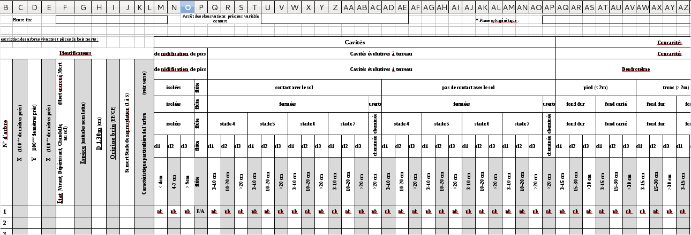
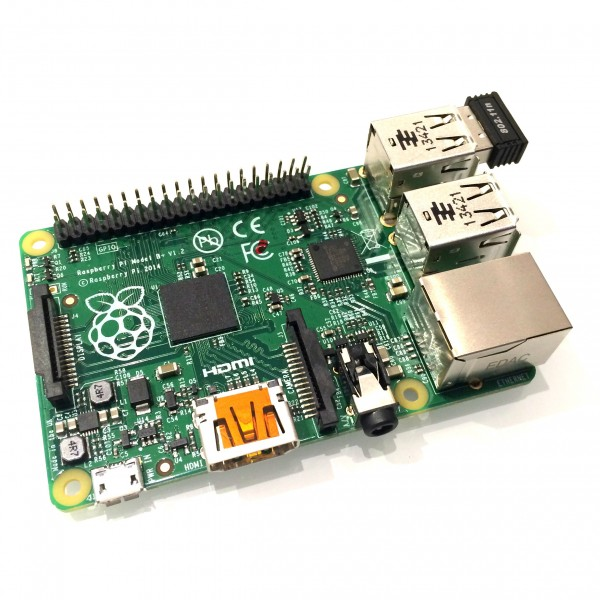

---
title       : "Nano-ordinateurs et suivis naturalistes"
subtitle    : Avantages et inconvénients des bases de données embarquées
author      : Wilfried Heintz
date        : October 05, 2016
job         : UMR 1201 Dynafor, INRA, Toulouse
framework   : io2012        # {io2012, html5slides, shower, dzslides, ...}
highlighter : highlight.js  # {highlight.js, prettify, highlight}
hitheme     : tomorrow      #   
widgets     : [bootstrap, quiz]            # {mathjax, quiz, bootstrap}
mode        : selfcontained # {standalone, draft}
license     : by-nc-sa
logo        : INRA_logo.png
knit        : slidify::knit2slides
ext_widgets : {rCharts: [libraries/nvd3]}

--- 
## Contexte scientifique

 <h3>Relevés de terrain et suivis à long terme</h3>

 - Nombreux projets scientifiques
 
 - Collectes de données pluri-annuelles
 
 - Plusieurs terrains d'études
 
 - Équipe de plusieurs collecteurs
 
 - Bases de données (PostgreSQL/PostGIS) intégrées dans une IDS 
 

--- 

## Collecte de données

 <h3>Méthodes et outils divers</h3>

 
 - Excel, formulaires Web ... mais aussi fiches papier
 - Tablettes, smartphones, PC durcis, crayons ...
 

=> Perte possible de données

=> Complexité du paramétrage du matériel portable

=> Du **temps** pour l'intégration dans le SI

--- 

## Les objectifs

 - Proposer un système **simple**, fiable et (vraiment) portable
 
("Moi je vais plus vite en écrivant sur ma fiche papier")

 - Mieux contrôler la **qualité** des données dès la collecte
 
 - "Fluidifier" l'intégration dans le SI
 
 - ... Sans bouleverser les habitudes ;-)

--- 

## Une (la ?) solution : Nano-ordinateur

 <h3>Les avantages</h3>
 

 
 - Retour d'expérience Geo-poppy : Julien a déjà tout fait !
 
 - Portabilité : léger et peu encombrant
 
 - Très faible coût : réplicable
 
 - Conteneurisation : déploiement facilité
 
 - Un seul boitier pour plusieurs collecteurs

--- 

## Une (la ?) solution : Nano-ordinateur

 <h3>Les avantages</h3>
 
 
 - Compatible avec les supports existants : peu de dépenses
 
 - Utilisation de formulaires existants : pas de dépaysement !
 
 - OS Linux : fiabilité
 
 - Déport de l'autonomie et de la "complexité" sur le rpi

--- 

## Une (la ?) solution : Nano-ordinateur

 <h3>Les inconvénients</h3>

 - Adaptation de l'ergonomie
 
 - Quelques paramétrages ...
 
 - Formation à Docker (rentable mais pas pas indispensable)
 
 - Synchronisation nécessaire 
 
 - Gestion des UUID

--- 

## Premier bilan

 
 - 3 applications installées :
   - relevés floristiques
   - suivi de dendro-microhabitats
   - indice de biodiversité potentielle

 - Satisfaction générale !
 
 - Pas de perte de données 

--- 

## Points d'attention

 
 - Alimentation : 5V et 700mA minimum

=> bien choisir sa batterie !

 - Evolution rapide des versions ...
 
 - Sauvegarde : duplication des répertoires 
 de PostgreSQL sur clé
 

 

 
 
 
